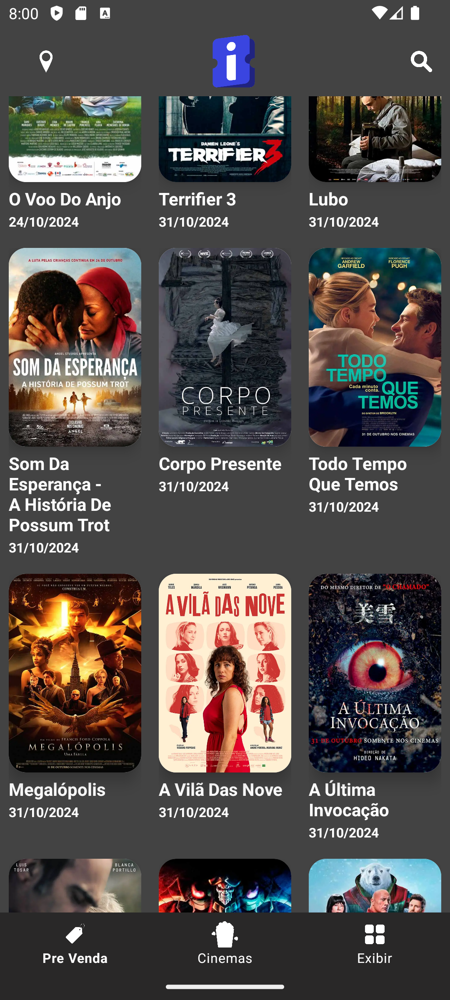

# Projeto: Teste técnico UOL/Ingressos.com

## Introdução
Este Readme serve como um guia para usuários e desenvolvedores que interagirem com o aplicativo para fins de avaliação. Ele inclui instruções sobre como executar o projeto, uma análise detalhada da sua arquitetura e explicações das minhas decisões técnicas tomadas durante o processo de desenvolvimento.
## :camera_flash: Screenshots
&emsp;

## Conteúdo
- [Primeiros Passos](#primeiros-passos)
- [Estrutura do Projeto](#estrutura-do-projeto)
- [Executando o Projeto](#executando-o-projeto)
- [Detalhes da API](#detalhes-da-api)
- [Tratamento de Erros](#tratamento-de-erros)
- [Tecnologias utilizadas](#tecnologias-utilizadas)
- [Dependências](#dependências-e-tomada-de-decisão)
- [Testes](#testes)
- [Trabalhos Futuros](#trabalhos-futuros)

### Primeiros Passos
#### Pré-requisitos
Para executar este projeto, você precisará de:
- Android 7.0 ou superior no dispositivo ou emulador.
- jvmTarget = "1.8"
- Kotlin e Android Studio na versão mais recente (2024.1)
- Uma conexão ativa com a internet para buscar dados da API

### Estrutura do Projeto
#### Visão Geral
O aplicativo é estruturado em mvvm:
- **Model**: Contém classes de dados para objetos "Movie" que modela o items em json vem em respostas da API, nessas classes o json vira um objeto kotlin facilmente manipulavel no codigo.
- **Remote**: Definições de interface para o Retrofit buscar dados da API de forma segura.
- **Repository**: Fornece métodos para o viewmodel utilizar esses dados vindos da API.
- **View**: Atividades e layouts XML responsáveis por apresentar dados ao usuário de forma clara e intuitiva.
- **ViewModel**: Gerencia a lógica de negócios do aplicativo e comunica entre o Modelo e a View.
- **Testes**: Testes unitários para a camada Repository.

#### Diretórios e Arquivos
app/

└── src/

    ├── main/
    │   ├── java/
    │   │   ├── com/
    │   │   │   ├── example/
    │   │   │   │   ├── ingressoscom/
    │   │   │   │   │   ├── apresentacao/
    │   │   │   │   │   │   ├── model/
    │   │   │   │   │   │   ├── remote/
    │   │   │   │   │   │   ├── repository/
    │   │   │   │   │   │   ├── view/
    │   │   │   │   │   │   │   ├── Adapter/
    │   │   │   │   │   │   │   ├── Util/
    │   │   │   │   │   │   ├── viewmodel/
    │   ├── res/
    │   ├── AndroidManifest.xml
    ├── test/
    │   ├── java/
    │   │   ├── com/
    │   │   │   ├── example/
    │   │   │   │   ├── ingressoscom/
    │   │   │   │   │   ├── repository/
    │   │   │   │   │   │   ├── MovieRepositoryTest.kt

### Executando o Projeto
### Opção 1
#### Configuração e Execução
1. Abra o projeto no Android Studio.
2. Por segurança sincronize `Build.gradle.kts(module app)`
3. Construa o projeto usando `Build > Rebuild Project`.
4. Certifique-se de que seu emulador ou dispositivo de teste está selecionado na barra de ferramentas.
5. Execute o projeto clicando em `Run > Run 'app'`.

### Opção 2
#### Configuração e Execução
1. Abra o projeto no Android Studio.
2. Por segurança sincronize `Build.gradle.kts(module app)`
3. Construa o projeto usando `Build > Rebuild Project`.
4. Gere um APK e transfira pra um smartphone android, proceda a instalação.

### Detalhes da API
#### Endpoints
O endpoint usado neste projeto foi o fornecido para o teste.
Este endpoint recupera uma lista de filmes que estão prestes a ser lançados em json.
- **OBSERVAÇÃO:** Sei que não é uma boa prática deixar a chave API Exposta Hardcode, mas por questões de facilidade de configuração na hora da avaliação, optei por deixar ela dessa forma.

#### Modelo de Dados
Componentes chave do modelo de dados incluem:
- **Movie**: Representa um filme com propriedades como título, sinopse, elenco, etc.
- **Movie** contem outras classes associadas a ela conforme a resposta da API necessitou.
- **MovieResponse**: Encapsula uma lista de filmes conforme retornada pela API.
- Escolhi utilizar **@Parcelize** e a interface **Parcelable** por ser uma abordagem mais eficiente e simplificada no contexto da aplicação. O uso de @Parcelize reduziu significativamente a quantidade de código boilerplate que o projeto viria a ter, automatizando a implementação da serialização necessária para transmissão eficiente de dados entre as duas activitys do sistema. Esta escolha não só melhora a performance pela natureza otimizada de Parcelable em comparação com Serializable, mas também facilita a integração com APIs do Android, oferecendo uma maneira robusta e escalável de gerenciar estados e dados.

### Tratamento de Erros
O aplicativo lida com vários cenários de erro, incluindo falhas de rede, falhas da API e respostas inválidas. As camadas de Repositório e ViewModel usam blocos try-catch para gerenciar exceções e fornecer feedbacks relevante para a interface do usuário, assim o usuario sabe de forma traduzida o que esta acontecendo, pois ele esta sendo sempre informado dos estados por meio de **Toasts**.

### Tecnologias utilizadas
- Android Studio
- Kotlin
- Kotlin Parcelize
- Android SDK
- AndroidX Test
- JUnit
- Mockito
- Kotlin Coroutines
- Retrofit
- Gson
- OkHttp
- Glide
- Timber
- AndroidX Lifecycle
- AndroidX ViewModel
- AndroidX LiveData
- AndroidX Core KTX
- AndroidX AppCompat
- Material Components
- AndroidX ConstraintLayout
- AndroidX RecyclerView
- AndroidX SwipeRefreshLayout
- Google Play Services Location

### Dependências e tomada de decisão
Este projeto utiliza as seguintes bibliotecas:

- Kotlinx Coroutines: Foi utilizada pois facilita todo o trabalho com operações assíncronas de maneira eficiente e legível, evitando callbacks aninhados e complexidade desnecessária, integrando-se bem com a arquitetura do Kotlin.
- Retrofit e Gson Converter: Retrofit é a biblioteca padrão para realizar chamadas de rede em aplicativos Android, tendo mais suporte e por isso foi usada devido à sua eficiência e facilidade de uso. Combinada com Gson, facilita a serialização e desserialização de objetos JSON, o que facilita e se torna essencial para consumir APIs REST.
- OkHttp: Geralmente usado junto com Retrofit, neste projeto utilizei nos testes do `MovieRepository.kt`, OkHttp é um otimo cliente HTTP que suporta conexões persistentes, otimização de cache e recuperação automática de falhas, sendo muito importante pra algumas integrações futuras do projeto.
- Glide: Foi a nossa biblioteca de carregamento de imagens e caching, escolhida por sua performance e simplicidade para integrar imagens de Internet diretamente em views, fazendo isso de forma bem automatica e com codigo limpo.
- Timber: Facilita o logging no desenvolvimento Android em comparação com os Logs padrões, não precisa a especificação de tags, é mais extenso e pode ser usado de outras maneiras permitindo uma depuração mais eficiente e uma maneira simples de controlar a saída de log, com poucas linhas você gerencia os logs do app em cada parte.
- AndroidX Lifecycle, ViewModel e LiveData: Suportam a implementação da arquitetura MVVM, gerenciando o ciclo de vida de UI components de forma eficiente e permitindo a comunicação entre o banco de dados e a interface do usuário da forma padrão atualmente.
- Google Play Services Location: Fornece APIs para serviços de localização, foi usada de forma simples pra fornecer a localização do usuario no toolbar.

### Testes
Testes unitários são fornecidos para as camadas de Repositório. Esses testes usam Mockk para simular respostas da API e verificar o comportamento desses componentes.

### Trabalhos Futuros
- **Caching**: Implementar caching para armazenar filmes localmente e reduzir chamadas de API.
- **Autenticação de Usuário**: Adicionar autenticação de usuário para recomendações personalizadas de filmes.
- **Detalhes Expandidos do Filme**: Incluir informações mais detalhadas.
- **Sugestões específicas**: Criar uma experencia de usuario mais detalhada, quem sabe usar um agente de IA personalizado com as caracteristicas da marca e fornecer recomendações com base nas peculiaridades de cada usuario.
- **Notificações Push** Implementas notificações push para alertar os usuários sobre as estreias dos filmes ou quando um filme que eles favoritaram está prestes a entrar em cartaz.Mantendo eles mais engajados com o app.
- **Avaliações e Comentários** Permitir esse contato pra que os usuários avaliem e comentem sobre os filmes. Isso pode ajudar a criar uma comunidade dentro do aplicativo e fornecer informações valiosas para outros usuários que estão considerando assistir a um filme.
- **Integração com Calendário**Oferecer a opção de adicionar as datas de estreia dos filmes ao calendário do usuário. Isso pode ajudar os usuários a se organizarem para assistir aos filmes no dia do lançamento.
- **Recomendações Baseadas em Localização** Implementar as funcionalidades que recomendem filmes com base na localização do usuário, buscando dados de cinemas proximos e até mostrando horários disponíveis.
- **Filtros de Pesquisa Avançados** Além de buscar por nome do filme, permitir que os usuários filtrem filmes por gênero, duração do filme, classificação etária, e críticas. Isso torna a busca mais direcionada e útil.
- **Resumo de Notícias ou Blogs de Cinema** Ter uma aba no app que integre uma seção de notícias ou um blog dentro do aplicativo que trate de novidades sobre cinema, lançamentos de trailers, e análises de filmes. Isso pode aumentar o tempo de engajamento no aplicativo, quem sabe tendo um parceiro oficial pra essas .

